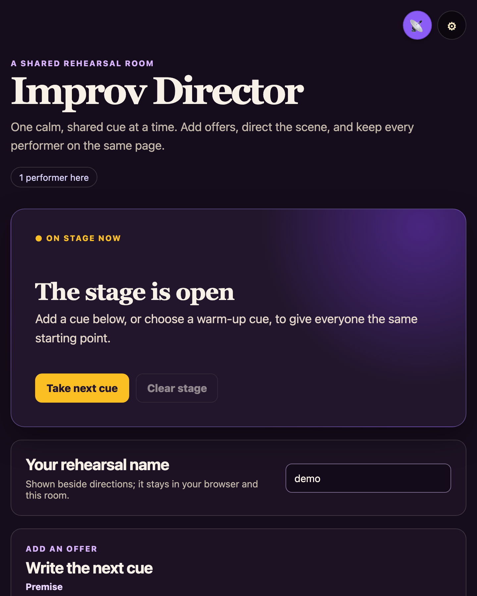
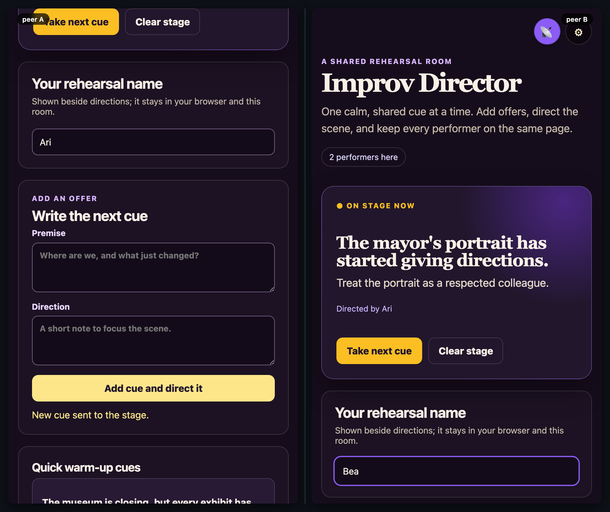

# mesh-improv-director

[](https://baditaflorin.github.io/mesh-improv-director/)
[](https://github.com/baditaflorin/mesh-improv-director/blob/main/package.json)
[](./LICENSE)

> A browser-local shared prompt director for accessible improv sessions.

**Live → https://baditaflorin.github.io/mesh-improv-director/**

**Source → https://github.com/baditaflorin/mesh-improv-director**

**Tip the dev (buy a coffee) → https://www.paypal.com/paypalme/florinbadita**

---



> Two peers, side-by-side, in the same room. Drop a `tests/demo/scenario.mjs`
> exporting `default async (a, b) => …` and run `npm run demo` to regenerate
> `docs/preview.png` plus `docs/demo-a.webm` / `docs/demo-b.webm` clips.



## What it is

A **rootless-computing** peer-to-peer browser app for a facilitator and performers to share one clear improv cue at a time. Add a premise and a short direction, direct it to every peer, advance or clear the stage, and keep an accessible shared cue deck for the next scene. Input is bounded and normalized before it reaches the shared Yjs mesh.

It uses no accounts, analytics, camera, microphone, or recordings. The only information shared is the rehearsal name and cues a participant deliberately publishes to the room.

Read the principles → **https://baditaflorin.github.io/rootless-computing/principles.html**

## Quickstart

Open the live URL on two devices in the same room (set in ⚙ settings, or scan the room QR). Everything else is in-app.

For local hacking:

```bash
git clone https://github.com/baditaflorin/mesh-common
git clone https://github.com/baditaflorin/mesh-improv-director
cd mesh-improv-director
npm install
npm run dev
```

`mesh-common` must sit as a **sibling** directory because `package.json` references it via `file:../mesh-common`.

## Self-hosted infrastructure

| Repo                                              | Endpoint                               | Purpose                     |
| ------------------------------------------------- | -------------------------------------- | --------------------------- |
| https://github.com/baditaflorin/signaling-server  | `wss://turn.0docker.com/ws`            | y-webrtc signaling fan-out  |
| https://github.com/baditaflorin/turn-token-server | `https://turn.0docker.com/credentials` | HMAC TURN creds, 1-hour TTL |
| https://github.com/baditaflorin/coturn-hetzner    | `turn:turn.0docker.com:3479`           | TURN relay                  |

## Settings overrides

The settings drawer lets the user override signaling and TURN endpoints. localStorage keys:

- `mesh-improv-director:signalingUrl`
- `mesh-improv-director:turnTokenUrl`
- `mesh-improv-director:iceServers`
- `mesh-improv-director:room`

If endpoints are blank or unreachable, the app falls back to STUN-only.

## Version + commit on every screen

The bottom-right footer on every screen of the live app shows:

- `source` → this repo
- `tip ♥` → PayPal
- `vX.Y.Z · <short-sha>` — version from `package.json` plus the build-time git commit

## Build & deploy

GitHub Pages serves the committed `docs/` directory on the `main` branch. There is no GitHub Actions build workflow; local Husky-style hooks gate formatting / typecheck / smoke build before each push.

```bash
npm run smoke                                    # build + sanity-check docs/
bash ../mesh-common/scripts/screenshot-app.sh    # regenerate docs/screenshot.png
```

## Privacy

<!-- mesh:privacy-section:start -->

Everything you publish to a room is visible to every peer in that room. Your local device's name, key, and choices stay local. Cryptographic signatures prove **who** wrote each entry; they do **not** prevent peers from reading or copying entries. The room URL is the access control — share it deliberately.

See `docs/privacy.md` for the full threat model — capabilities used, what other peers in the mesh see, what the self-hosted infra sees, what stays local.
<!-- mesh:privacy-section:end -->

## License

MIT — see `LICENSE`.
